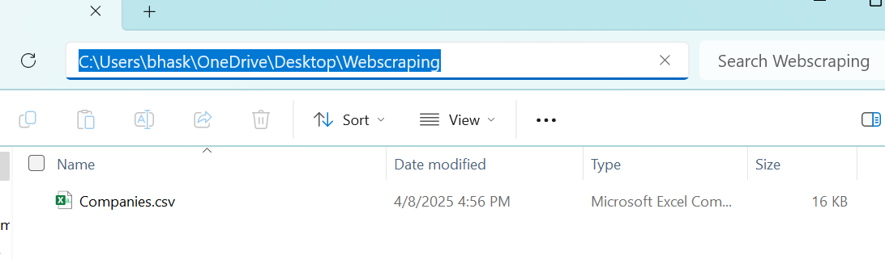

# Web Scraping & Data Analysis Project


This project demonstrates how to extract data from a live website using Python and perform basic analysis using `pandas`.

## Overview

In this project, I used **BeautifulSoup** and **requests** to scrape tabular data from a live website. The extracted HTML content was parsed and cleaned using **pandas**, followed by exporting the clean dataset to a CSV file.

## Technologies Used

- Python 3
- BeautifulSoup
- requests
- pandas
- Jupyter Notebook

## Key Skills Demonstrated

- Web scraping with BeautifulSoup
- HTML parsing and data extraction
- Data cleaning and transformation using pandas
- Exporting structured data to CSV
- Basic exploratory analysis

```
Web-Scraping-project/ 
├── WebScrapingTutorial.ipynb # Main Jupyter notebook with code and results
├── requirements.txt # Python libraries required to run the project
├── Companies.csv # Exported output data file from the scraping process
├── README.md # Detailed project overview and instructions 
├── LICENSE # License info for open-source use
├── .gitignore # Files to ignore in version control
```
